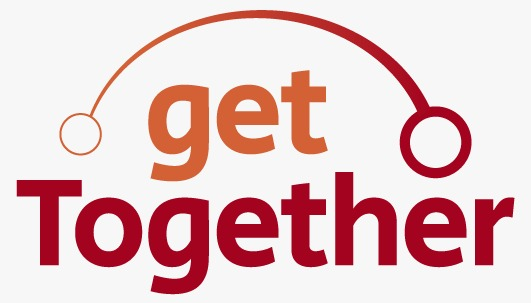
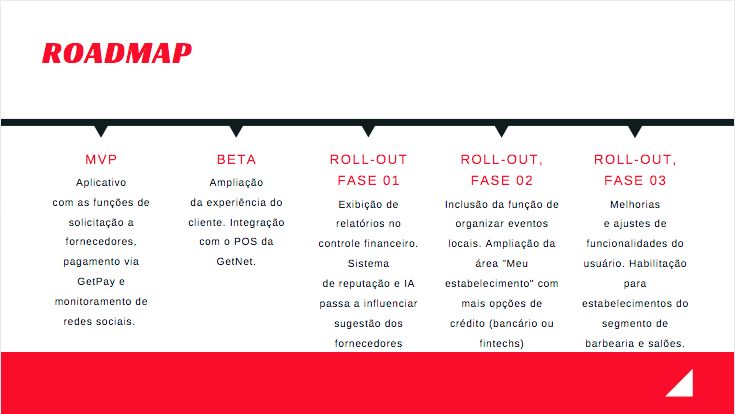

<h1 align="center">
    
</h1>

<h4 align="center"> 
	🚧 GetTogether 🚀 em construção... 🚧
</h4>

<p align="center">
  

  
 
  <a href="https://github.com/andrefmsouza/GetTogether/commits/master">
    
  </a>

  
   
</p>


## 💻 Sobre o projeto

A pandemia dificultou ainda mais a liberação de crédito e a conquista de novos clientes para os 6,4 milhões de pequenos empreendedores no Brasil - tais como o Felipe, dono de uma hamburgueria. 

Essas empresas representam hoje quase 30% do PIB.

Por isso, estamos unindo esforços para ficar mais fortes.

Conheça o getTogether, um aplicativo que conecta os empreendedores da vizinhança. 

Com ele, as empresas se complementam por meio da solicitação de produtos, reduzindo a necessidade de crédito e movimentando a economia de bairro.

O app sugere fornecedores próximos permitindo negociações via whatsapp. 

Em seguida, é possível pagar via GetPay ou pelo GetSplit, que é o rateio para cada fornecedor assim que o produto final é vendido. 

É uma espécie de empréstimo que compromete até 30% do valor de vendas e substitui a demanda por crédito - por vezes caro ou inacessível.

Também oferecemos o radar de oportunidades: monitorando as redes sociais, informamos a empresa sempre que sua categoria de produtos é mencionada por alguém de sua região, permitindo, assim, o contato.

Com isso, a GetNet se torna um player diferenciado apoiando empreendedores. A monetização vem do aumento de transações e de possíveis contratações de empréstimo por maquininha: com acesso ao controle financeiro dos estabelecimentos, é mais fácil avaliar a solicitação e definir a taxa.

Com o fortalecimento do senso de grupo, no futuro será possível organizar eventos na vizinhança e nossa inteligência artificial vai automatizar ainda mais os processos. 

Este é o início da transformação econômica do país. Nós incentivamos a colaboração e a digitalização dos pequenos negócios - como o do Felipe, que tem tudo para prosperar. 

Junte-se a nós: getTogether!

## 🎨 Layout

O layout da aplicação está disponível no AdobeXD:

<a href="https://xd.adobe.com/view/3409b878-8dab-4f3c-a314-122d617ba4da-615a/specs/">
  
</a>

## 🛠 Tecnologias

Para a construção do MVP, utilizamos as seguintes tecnologias:

- [VuejJS][vuejs]
- [Firebase][firebase]


## 🚀 Como executar o projeto

Para executar o projeto, basta baixar os arquivos do github com o seguinte comando:

```bash
# Clone este repositório
$ git clone https://github.com/andrefmsouza/GetTogether

```

Para executar o projeto, basta baixar os arquivos do github com o seguinte comando:

```bash
# Clone este repositório
$ git clone https://github.com/andrefmsouza/GetTogether

```

Feito isso, abra o arquivo index.html no navegador de sua preferência (sugerimos a utlização do Google Chrome)


##  Roadmap




Feito com ❤️ pela equipe 11 do Hackathon Getnet 

André Souza
Eraylson Galdina
Gabriel Nicolsky
Igor Maule
Tiago Rodrigo

[vuejs]: https://vuejs.org/
[firebase]: https://firebase.google.com/
[vceditconfig]: https://marketplace.visualstudio.com/items?itemName=EditorConfig.EditorConfig
[vceslint]: https://marketplace.visualstudio.com/items?itemName=dbaeumer.vscode-eslint
[prettier]: https://marketplace.visualstudio.com/items?itemName=esbenp.prettier-vscode